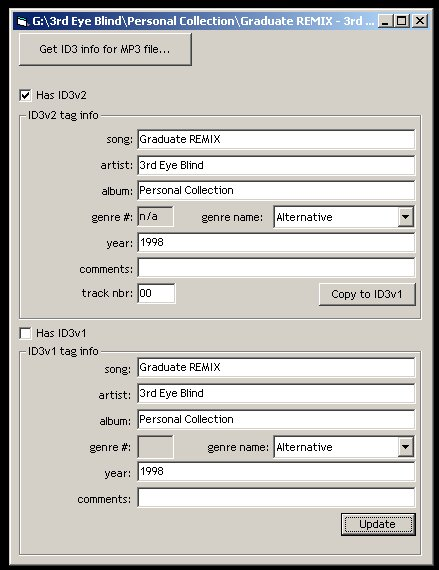

## MP3 ID3v1 and ID3v2 tag reader

### Description

Reads and writes ID3v1 tag info for MP3s, including genre. Reads ID3v2 tag info for MP3s. Extracts track title, artist, album, year, genre. Also extracts comments (ID3v2 only) and track number (ID3v2 only).
 
### More Info
 
Filename of an MP3 file.

             |
---                |---
**Submitted On**   |2001-04-27 04:56:10
**By**             |[Kevin Pohl](https://github.com/Planet-Source-Code/PSCIndex/blob/master/ByAuthor/kevin-pohl.md)
**Level**          |Beginner
**User Rating**    |4.5 (27 globes from 6 users)
**Compatibility**  |VB 5\.0, VB 6\.0
**Category**       |[Sound/MP3](https://github.com/Planet-Source-Code/PSCIndex/blob/master/ByCategory/sound-mp3__1-45.md)
**World**          |[Visual Basic](https://github.com/Planet-Source-Code/PSCIndex/blob/master/ByWorld/visual-basic.md)
**Archive File**   |[MP3 ID3v1 188734272001\.zip](https://github.com/Planet-Source-Code/kevin-pohl-mp3-id3v1-and-id3v2-tag-reader__1-22728/archive/master.zip)

